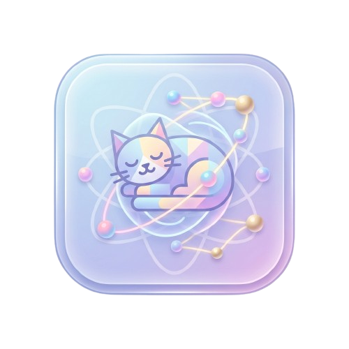

<div align="center">
  
</div>

# ⚛️ QuantumStart

### *Mastering the weird, the tiny, and the "both-at-once."*

[](https://vitejs.dev/)
[](https://react.dev/)
[](https://www.typescriptlang.org/)
[](https://threejs.org/)
[](https://vercel.com/)

---

## 🐾 Meet Qubit
QuantumStart is your interactive gateway into the world of quantum computing, led by **Qubit**—a cat who exists in a state of deep superposition (or maybe just a fuzzy nap). Together, you'll break the "on or off" rules of classical computing and learn the secret language of the universe.

## 🚀 Key Features

- **Interactive Quantum Playground**: Experiment with real-time quantum simulations using a high-fidelity **3D Bloch Sphere**.
- **Intuitive Circuit Builder**: Design and run your own quantum circuits with a drag-and-drop interface for Hadamard, Pauli-X, CNOT, and more.
- **Visual Learning Journey**: Structured educational modules that guide you from the basics of qubits to complex entanglement.
- **Statistical Measurement**: Visualize measurement outcomes through dynamic histograms and state vectors.
- **Interactive Challenges**: Test your knowledge with hands-on tutorial challenges and puzzles.

## 🛠 Tech Stack

- **Framework**: [React 19](https://react.dev/) with [TypeScript](https://www.typescriptlang.org/)
- **Build Tool**: [Vite](https://vitejs.dev/)
- **3D Rendering**: [Three.js](https://threejs.org/) using [@react-three/fiber](https://r3f.docs.pmnd.rs/getting-started/introduction) and [@react-three/drei](https://github.com/pmndrs/drei)
- **Animations**: [Framer Motion](https://www.framer.com/motion/)
- **State Management**: React Context & Hooks
- **Drag & Drop**: [@dnd-kit/core](https://dndkit.com/)
- **Charts**: [Chart.js](https://www.chartjs.org/) via [react-chartjs-2](https://react-chartjs-2.js.org/)
- **Design**: Vanilla CSS Modules for high-performance, modular styling.

## 📦 Getting Started

### Prerequisites
- Node.js (v18 or higher)
- npm or yarn

### Installation
1. Clone the repository:
   ```bash
   git clone https://github.com/Maysamaysa/three.git
   cd three
   ```
2. Install dependencies:
   ```bash
   npm install
   ```
3. Start the development server:
   ```bash
   npm run dev
   ```

### Building for Production
```bash
npm run build
```

## 📂 Project Structure

```bash
src/
├── components/      # Reusable UI & Quantum components (BlochSphere, CircuitBuilder)
├── context/         # Global state (CatContext, QuantumContext)
├── hooks/           # Custom React hooks (useTypewriter, etc.)
├── models/          # 3D assets and procedural shaders
├── pages/           # Main views (Landing, Learn, Playground, Profile)
├── tutorials/       # Lesson content and challenge definitions
└── assets/          # Static images and icons
```

## 🌟 Contributing
We welcome observers from all states of superposition! Whether you're fixing a bug, suggesting a feature, or just pointing out a typo, feel free to open a PR.

## 📄 License
This project is for educational purposes as part of a university project. All rights reserved by the original authors.

---

<p align="center">
  <i>"I'm Qubit, your guide to the weird, the tiny, and the 'both-at-once.' We call it Quantum, and it's the secret language of the universe."</i>
</p>
